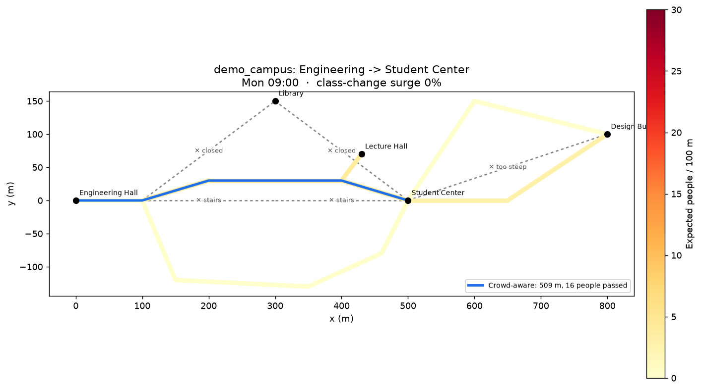
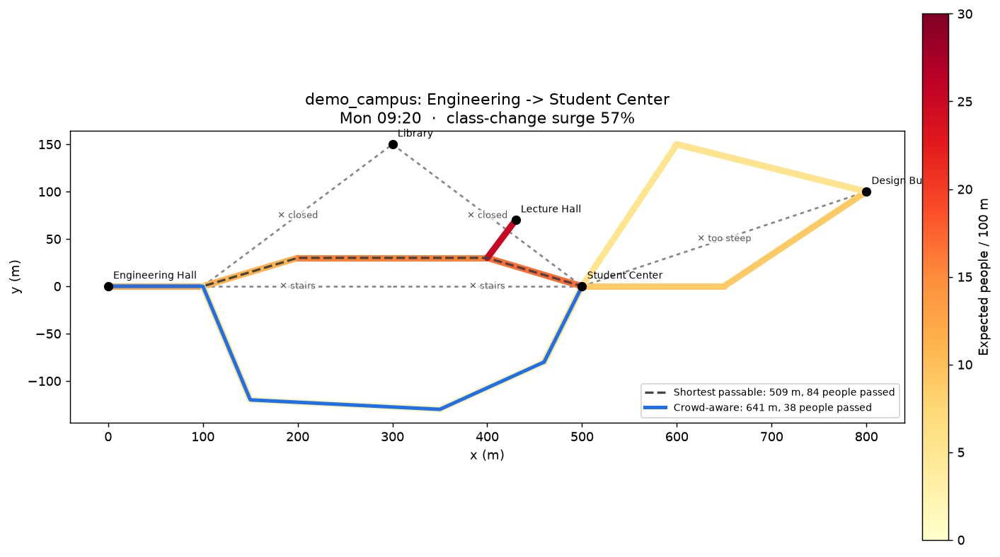

# UH Mānoa Rover

A camera-only autonomous rover that learns to navigate the University of Hawaiʻi at Mānoa campus. It is trained in NVIDIA Isaac Sim on a reconstructed digital twin of the campus.

- **[docs/SCOPE.md](docs/SCOPE.md):** full project scope (phases, mainland proof of concept, data plan, risks)
- **[docs/LIBRARIES.md](docs/LIBRARIES.md):** open-source libraries for each pipeline stage

## The short version

1. **Data**: build a 3D campus from open lidar, GIS, OSM, and Mapillary now; upgrade it with phone footage later.
2. **Reconstruct**: build a clean 3D Gaussian-splat and mesh twin with people, cars, and animals removed.
3. **Simulate**: load the twin into Isaac Sim and add pedestrians, bikes, carts, cars, and the campus chickens and cats.
4. **Learn**: train camera-only perception, prediction, and crowd-aware navigation.
5. **Transfer**: move from sim to a real rover, starting on one short route and then expanding across campus.

## What works today: the crowd-aware route planner

The planner picks a route by time of day. It takes a longer, calmer path when a class change floods the main walkway, and never uses stairs, closed (construction) paths, or slopes steeper than an ADA ramp.

| Mon 09:00, mid-class: takes the mall | Mon 09:20, class change: detours south |
|---|---|
|  |  |

Each walkway's cost combines distance, expected crowd **at the moment the rover reaches it**, how hard the segment is to read, and slope. Expected crowd comes from the class schedule (surges after classes end and before they start) plus all-day zone baselines such as a lunch rush. The rover also slows down in crowds, so a detour can even arrive sooner.

### Quickstart

```bash
python -m venv .venv && source .venv/bin/activate
pip install -e ".[dev]"

campus-rover sites
campus-rover plan  --site demo_campus --route A  --time "Mon 09:20" --plot out/a.png
campus-rover sweep --site demo_campus --route A  --day Mon --start 08:00 --end 12:00 --step 10
campus-rover plan  --site demo_campus --route AB --time "Tue 12:05"   # lunch rush on route B

pytest -q && ruff check .
```

Example output:

```
demo_campus · route A: Engineering -> Student Center
depart Mon 09:20 · class-change surge 57%

segment                    length  crowd/100m
east_path                    100m        12.6
South path                   330m         8.9
South ramp                   121m         3.5
South path                    89m         4.3

total 641 m · 11.6 min · arrive Mon 09:32 · ~38 people passed

- Avoids Central Mall: about 21 people/100 m expected at Mon 09:25.
- Detour: +132 m and 1.3 min faster, since the rover slows down in crowds, vs. the shortest passable path.
- Crowd exposure: 38 vs. 84 people passed (54% fewer).
```

### UH Mānoa

`sites/uh_manoa/` already defines Route A (Holmes Hall → Campus Center), Route B (Campus Center → Architecture), the Hamilton Library construction closure, and the MWF/TR class blocks. The walkway graph comes from OpenStreetMap:

```bash
pip install -e ".[osm]"
campus-rover import-osm --site uh_manoa     # needs network access to overpass-api.de
campus-rover plan --site uh_manoa --route AB --time "Mon 09:20" --plot out/uh.png
```

After the first import:
- Check that the landmark names matched (the importer warns if one didn't).
- Tag McCarthy Mall and other busy walkways with a `zone`.
- Replace the placeholder `people_per_change` numbers with estimates from the class schedule.

### Adding a site

Copy `sites/demo_campus/` and edit three files:
- `site.yaml`: landmarks, routes, closures, crowd sources, and planner weights.
- `schedule.yaml`: class time blocks.
- `graph.yaml`: the walkway graph. Draw it by hand, or import it with `import-osm`.

All code is site-agnostic, so the mainland proxy campus and UH run the same pipeline.
