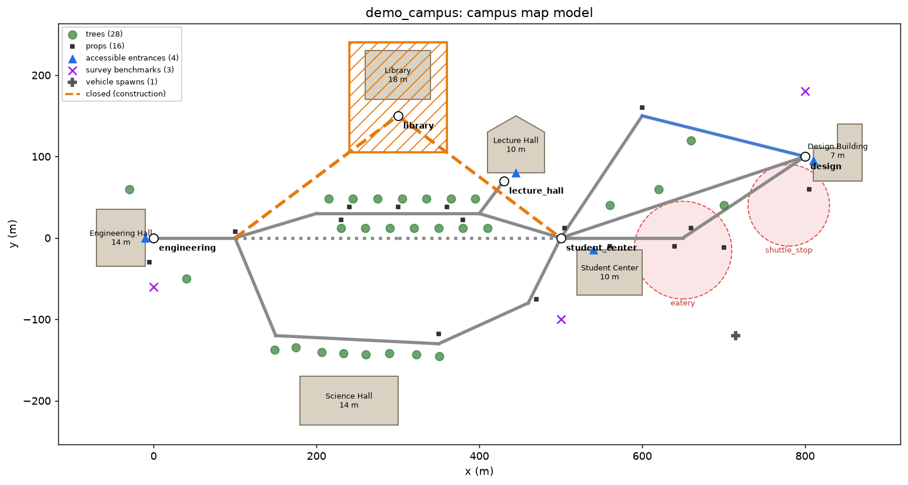
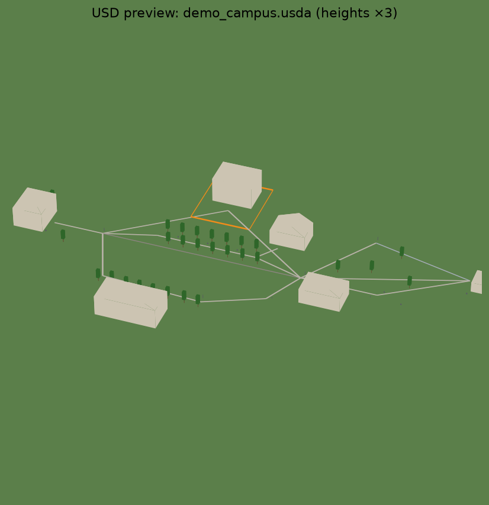

# Building the UH Mānoa Map Model

This is how the UH campus map (map.hawaii.edu/manoa) becomes:

1. the **planning model**: walkways with construction closures and crowd sources, used by the route planner, and
2. the **3D training scene**: an OpenUSD file Isaac Sim opens, with buildings, walkways, trees, benches, call boxes, construction barriers, and semantic labels for segmentation ground truth.

| Demo campus: map model | Same model exported to USD, read back |
|---|---|
|  |  |

The demo campus runs the same pipeline on synthetic layers. UH needs its real layer data downloaded first (below).

---

## 1. What the saved campus-map HTML contains

The UH map is an **Esri ArcGIS** web app. The saved HTML is only the app's shell:

- ✅ **The layer catalog**, meaning every layer name in the "Explore UH Mānoa" panel. These names are mapped to roles in [`sites/uh_manoa/layers.yaml`](../sites/uh_manoa/layers.yaml).
- ✅ **UH's disclaimer:** the layers are approximate and "for visualization purposes only."
- ❌ **No geometry.** Buildings, trees, and the rest load at runtime from ArcGIS services. Their URLs live in the JavaScript files saved next to the HTML (`…Campus Map_files/config.js.download`, `webMapLoader.js.download`), not in the HTML itself.

## 2. Getting the layer data: solutions, fastest first

### A. Use the saved `_files` folder (about 1 minute)

When the page was saved, the browser also saved a folder named `University of Hawaiʻi at Mānoa Campus Map_files/`. Scan it:

```bash
campus-rover scan-saved-page "University of Hawaiʻi at Mānoa Campus Map.html" \
                             "University of Hawaiʻi at Mānoa Campus Map_files/"
```

It prints any ArcGIS service URLs and web map IDs it finds. You can also upload `config.js.download` and `webMapLoader.js.download` to Claude, and Claude will fill in `layers.yaml`.

### B. Browser DevTools on the live map (about 5 minutes)

1. Open https://map.hawaii.edu/manoa/ in Chrome and press **F12**, then open the **Network** tab.
2. Type `FeatureServer` in the filter box (then try `MapServer`, and `query`).
3. In "Explore UH Mānoa", switch on each layer you need (Buildings, Trees, Outdoor Seating, ...).
4. Each layer makes requests like `https://…/rest/services/…/FeatureServer/7/query?...`. Copy everything up to and including the layer number (`…/FeatureServer/7`) into that layer's `url:` in `layers.yaml`.
5. Also look for a request containing `/sharing/rest/content/items/<32-character id>/data`. That ID is the **web map**, and option C turns it into every layer URL at once.

### C. Let the tool list every layer

```bash
campus-rover discover --webmap <32-char id> [--portal https://<portal>]   # from B.5 or A
campus-rover discover --url https://…/rest/services/…/FeatureServer      # from any layer URL
```

Paste the printed URLs into `layers.yaml`.

### D. Ask UH for the GIS files

UH Campus Environments / Facilities maintains this data. A short email asking for the campus map layers as shapefile or GeoJSON often gets more than the public map shows, such as building floor counts and heights, entrances, and full walkway centerlines. Put the files in `sites/uh_manoa/cache/layers/<key>.geojson`, or point a layer's `file:` at them. Export them in **EPSG:32604 (UTM 4N)**, or say so if they come in another CRS.

### E. Fallback: OpenStreetMap

If none of the above works, OSM has UH building footprints, many trees and benches, and the walkways (`campus-rover import-osm`). The roles are the same; only the source changes.

## 3. Download and build

These are plain Python scripts. **Run them on your own computer** (no sandbox), or allow the hosts in this cloud environment's network settings.

```bash
pip install -e ".[osm,usd,viz]"
campus-rover fetch-layers --site uh_manoa            # all layers with a url
campus-rover fetch-layers --site uh_manoa --only buildings trees
campus-rover import-osm   --site uh_manoa            # walkway graph
campus-rover build-model  --site uh_manoa --usd out/uh_manoa.usda --plot out/uh_model.png
campus-rover plan --site uh_manoa --route AB --time "Mon 09:20" --plot out/uh_route.png
```

- `fetch-layers` asks the server to project features straight into **EPSG:32604**, pages through big layers, pauses between requests, and saves to `sites/uh_manoa/cache/` (gitignored, so UH data stays out of the repo).
- `build-model --allow-no-graph` builds the 3D scene from the layers alone, before the walkway import.

## 4. How each layer is used

| Role | UH layers | Planner | 3D scene (USD) | Perception label |
|---|---|---|---|---|
| `building` | Buildings | Route endpoints: Holmes Hall, Campus Center, Architecture, matched by name | Extruded footprints with collision (floors × 3.5 m, or 12 m default) | `building` |
| `construction` | Active Constructions, Staging Areas | **Closes** every walkway that touches the area | 1.2 m barrier walls | `construction_barrier` |
| `tree` | Campus Arboretum / Trees | none | Trunk + canopy proxies, species stored | `tree` |
| `prop` | Outdoor Seating, Call Boxes, Bike/Skateboard Parking, Biki, EV chargers, Mail Boxes, Bulletin Boards, Recycling, Refuse, Art | none | Sized boxes with collision | `bench`, `emergency_call_box`, `bike_rack`, … |
| `accessible_entrance` | Automatic Doors, Elevators | Landmark snaps to the walkway node nearest an accessible door | Marker | none |
| `crowd_source` | Eateries, Food Trucks, Coffee, Shuttle & Bus Stops, Forum Areas | Adds time windows of crowd density to nearby walkways (lunch, commute) | none | none |
| `gcp` | Ground Survey Benchmarks | none | Marker with true easting/northing | none (georeferences splats later) |
| `vehicle_spawn` | Visitor/Accessible Parking, Parking Structures | none | Marker where sim cars and carts appear | none |

## 5. The USD scene

- **Z up, meters**, with default prim `/World`. UTM coordinates (about 620 km east) are **recentred** to the nearest 100 m so physics and rendering stay precise. The offset is stored in the layer metadata (`campus:originOffset`), so any point maps back to real UTM coordinates.
- Every object carries a **semantic class label** (`UsdSemantics`, `SemanticsLabelsAPI:class`), which Isaac Sim 5 Replicator uses for segmentation and bounding-box ground truth.
- Buildings, props, tree trunks, construction barriers, and the ground have **collision**.
- `/World/Markers/Landmarks/*` holds the route endpoints, i.e. the spawn and goal points for training tasks.

Opening it in Isaac Sim: **File → Open → `uh_manoa.usda`** (or `omni.usd.get_context().open_stage(path)`), add a Physics Scene, and drop in the rover.

## 6. Limits and next steps

| Limit now | Fix |
|---|---|
| UH geometry is approximate ("visualization only") | Check against lidar and OSM; use your own capture and splats later |
| The ground is flat | Add the Oʻahu lidar DEM as a terrain mesh (slopes matter at UH) |
| Building heights are floors × 3.5 m or a default | Lidar building heights |
| Proxy assets (boxes, cylinders) | Swap in real benches, trees, and people via asset references; Gaussian splats for the photoreal layer |
| Stairs are flat labeled ribbons | Stepped geometry (the planner already avoids them) |
| Some point layers are indoors (vending, water refill) | Filter with `where:` on the layer once the fields are known |
| Crowd densities are placeholders | Calibrate against real counts |

## 7. Using UH's data responsibly

The layers are served publicly by UH for its campus map. Fetch them once with polite pacing (built in), keep the raw downloads out of public repos (the `cache/` folder is gitignored), credit "University of Hawaiʻi at Mānoa" wherever the data shows up, and treat it as approximate, as UH's disclaimer says.
